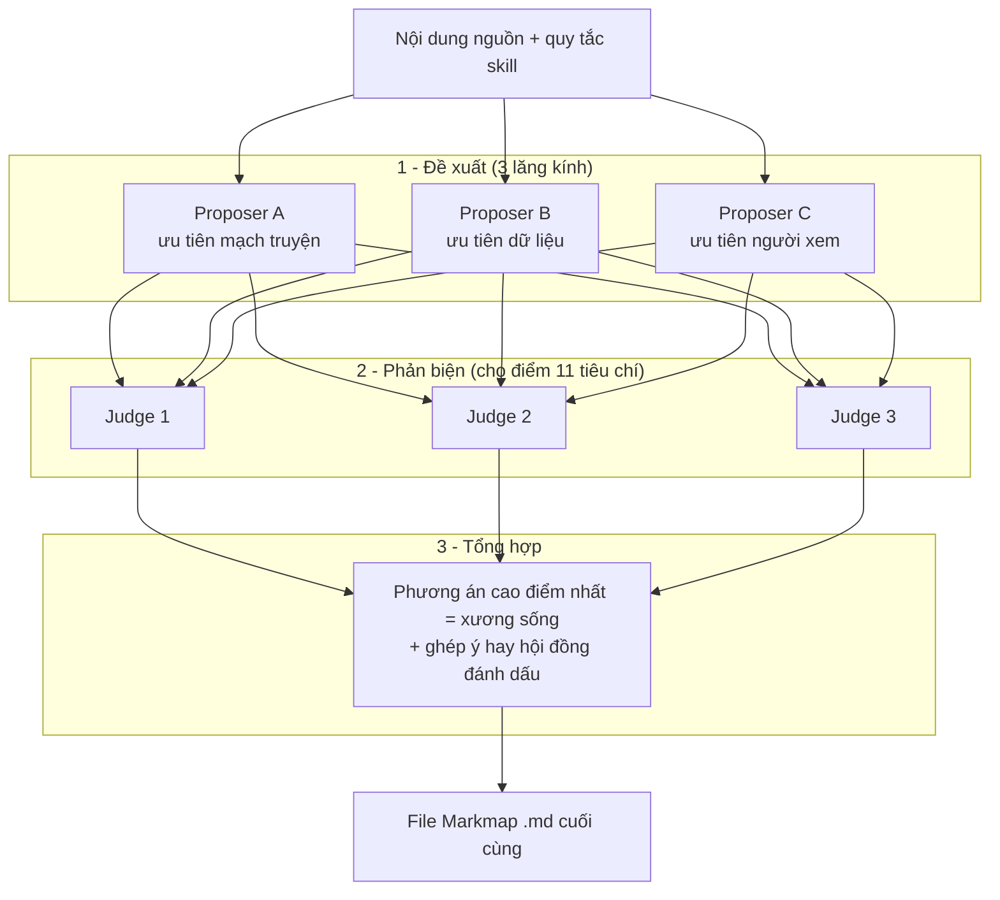

# mindmap

[English](README.md) | [Tiếng Việt](README.vi.md)

**Hiểu mọi tài liệu chỉ trong một cái nhìn — biến file, URL hay một chủ đề thành sơ đồ tư duy có thể zoom, ngay trong AI coding agent của bạn.**

`mindmap` là một plugin cho [Claude Code](https://docs.claude.com/en/docs/claude-code) và [GitHub Copilot](https://docs.github.com/copilot/concepts/agents/copilot-cli). Trỏ nó vào một báo cáo dày đặc, một bài viết dài, hoặc chỉ một chủ đề — nó sẽ chắt lọc các ý chính thành một sơ đồ tư duy [Markmap](https://markmap.js.org) gọn gàng, zoom được, ngay trong terminal của bạn.

> Một plugin, hai skill: `/mindmap` (tiếng Anh) và `/mindmap-vi` (tiếng Việt).

---

## Xem thử

Một câu lệnh biến một bài blog GitHub rất dài thành sơ đồ tư duy:

```
/mindmap https://github.blog/ai-and-ml/how-we-made-github-copilot-cli-more-selective-about-delegation/ --render
```

Một bài ~1.500 từ trở thành cấu trúc đọc xong trong vài giây:

```
# Smarter Subagent Delegation
├── The Problem
│   ├── Delegation is powerful but not free
│   └── Unnecessary handoffs, overlapping searches, waiting
├── The Approach
│   ├── Analyze → find the delegation bottleneck
│   ├── Change → handle focused work directly
│   └── Validate → offline, then online, then ship
├── Results
│   ├── Tool failures per session −23%
│   └── Wait time −5% P95, no quality regression
└── What's Next
```

Đây là output thật — xem [`examples/`](examples/) để có file Markmap `.md` đầy đủ cùng bản `.html` tương tác đã render (mở bằng bất kỳ browser nào để zoom và gập/mở nhánh).

**▶ [Mở sơ đồ tư duy tương tác trực tuyến](https://sonphamtrung17.github.io/my-mindmap-skills/examples/copilot-cli-selective-delegation.mindmap.html)** — không cần cài gì, chỉ cần click.

---

## Vì sao nên dùng

- **Nắm bắt tài liệu dày đặc thật nhanh** — gói một báo cáo 3.000 từ thành 5–7 nhánh quét mắt một lượt là hiểu, thay vì đọc từ đầu đến cuối.
- **Một câu lệnh, mọi nguồn đầu vào** — file, URL, ghi chú dán vào, hoặc chỉ một chủ đề. Không phải copy-paste sang một web tool khác.
- **Không phá vỡ luồng làm việc** — chạy ngay trong Claude Code / GitHub Copilot; sơ đồ được ghi ra thành file nằm cạnh chỗ bạn đang làm.
- **Cấu trúc thông minh, không phải đống text** — tận dụng cấu trúc có sẵn của tài liệu, hoặc chắt lọc văn bản rời rạc thành 4–7 nhánh súc tích. Node là cụm từ, không phải câu.
- **Kết quả di động và tương tác được** — file Markmap `.md` tiêu chuẩn mở được ở đâu cũng được, cộng thêm một file `.html` độc lập để chia sẻ.

**Phù hợp với:** đọc nhanh paper và báo cáo · tiêu hoá blog post và tài liệu · phác thảo một chủ đề trước khi viết · biến meeting note thành sơ đồ chia sẻ được.

---

## Cài đặt

Cùng một repo vừa là plugin hợp lệ cho Claude Code, vừa là plugin hợp lệ cho GitHub Copilot — cả hai dùng chung định dạng plugin/marketplace.

### Claude Code

```
/plugin marketplace add https://github.com/sonphamtrung17/my-mindmap-skills.git
/plugin install mindmap@mindmap-marketplace
/reload-plugins
```

> Dùng URL `https://` tường minh để tránh bị clone qua SSH. Dạng viết tắt `sonphamtrung17/my-mindmap-skills` cũng dùng được, **với điều kiện** bạn đã cấu hình SSH key cho GitHub; nếu không sẽ báo lỗi `Permission denied (publickey)`.

### GitHub Copilot

```bash
copilot plugin marketplace add sonphamtrung17/my-mindmap-skills
copilot plugin install mindmap@mindmap-marketplace
```

Sau đó chạy `/mindmap` (tiếng Anh) hoặc `/mindmap-vi` (tiếng Việt) trong session. Trên GitHub Copilot, workflow giữ nguyên; tên tool được map tự động (xem [`skills/mindmap-vi/references/copilot-tools.md`](skills/mindmap-vi/references/copilot-tools.md)).

Manifest của marketplace nằm ở [`.claude-plugin/marketplace.json`](.claude-plugin/marketplace.json).

### Cài thủ công (local, không qua marketplace)

Copy skill vào thư mục skills của project (hoặc của user):

```bash
# Cấp project
mkdir -p .claude/skills
cp -r skills/mindmap skills/mindmap-vi .claude/skills/

# Hoặc cấp user (dùng được ở mọi project)
mkdir -p ~/.claude/skills
cp -r skills/mindmap skills/mindmap-vi ~/.claude/skills/
```

Sau đó chạy `/reload-skills` (hoặc restart Claude Code). Dùng `/help` để xác nhận `/mindmap` và `/mindmap-vi` đã xuất hiện trong danh sách.

---

## Cách dùng

```
/mindmap <đầu-vào> [--panel] [--render] [--output <đường-dẫn>]
```

| Đầu vào | Ví dụ | Hành vi |
|---|---|---|
| **File** | `/mindmap bao-cao.md` | Đọc file, tận dụng cấu trúc của nó, nén lại thành các node. Ghi ra `bao-cao.mindmap.md`. |
| **URL** | `/mindmap https://example.com/article` | Fetch trang web (WebFetch), map nội dung. Ghi ra `<slug-của-trang>.mindmap.md`. |
| **Text dán vào** | `/mindmap "Ghi chú về X, Y, Z..."` | Chắt lọc các khái niệm thành nhánh. Ghi ra `<slug-tiêu-đề>.mindmap.md`. |
| **Chủ đề** | `/mindmap "vector database"` | Sinh sơ đồ từ kiến thức của model. Ghi ra `vector-database.mindmap.md`. |

**Tham số**

- `--panel` — thiết kế cấu trúc bằng hội đồng phản biện nhiều agent; dùng cho nguồn phức tạp hoặc quan trọng (xem **Hội đồng phản biện** bên dưới).
- `--render` — sau khi ghi `.md`, sinh thêm một file `.html` độc lập, tương tác được (cần Node.js / `npx`).
- `--output <đường-dẫn>` — ghi `.md` vào đường dẫn chỉ định thay vì đường dẫn mặc định.

---

## Hội đồng phản biện (`--panel`)

Với nguồn phức tạp hoặc quan trọng — paper, báo cáo dài — thêm `--panel`. Thay vì thiết kế cấu trúc trong một lượt, skill chạy một **hội đồng nhiều agent**: **3 proposer → 3 judge → 1 synthesizer**. Chúng cạnh tranh về cấu trúc và chọn format tốt nhất cho từng node.



**1 · Đề xuất** — ba agent, mỗi agent thiết kế một cấu trúc hoàn chỉnh theo một lăng kính khác nhau:

| Lăng kính | Dựng sơ đồ quanh... |
|---|---|
| **Ưu tiên mạch truyện** | mạch và trật tự các phần của chính nguồn |
| **Ưu tiên dữ liệu** | các con số chủ đạo và bằng chứng, mọi chỉ số đều **in đậm** |
| **Ưu tiên người xem** | punchline lên trước, mọi node lá đọc được trên slide |

Mỗi proposer cũng gán cho từng node một **format** và một **render tier**:

| Format | Tier | Phù hợp nhất cho |
|---|---|---|
| bullet list | `core` | các dữ kiện song song |
| bold inline | `core` | con số chủ đạo, nhấn mạnh |
| link | `core` | tài liệu tham khảo, repo, arXiv |
| table | `rich` | so sánh, số liệu benchmark |
| code block | `rich` | công thức, hàm reward, code |
| checkbox | `rich` | task, hạn chế, checklist |

**2 · Phản biện** — ba judge cho điểm độc lập từng phương án 1–5 trên **11 tiêu chí** (số nhánh, độ sâu, cách diễn đạt, độ dễ đọc, trung thực với nguồn, punchline-first, con số chủ đạo, node lá dễ đọc, cân đối thị giác, format phù hợp, và **node phải bằng tiếng Việt**), rồi nêu một ý hay nhất của từng phương án.

**3 · Tổng hợp** — một agent lấy phương án cao điểm nhất làm **xương sống**, ghép vào các ý hay nhất mà hội đồng đã đánh dấu từ hai phương án còn lại, rồi xuất ra file Markmap `.md` cuối cùng.

> **Chi phí:** hội đồng spawn khoảng 7 agent và tốn nhiều token — chỉ dùng cho nguồn xứng đáng. Không có `--panel`, skill dựng nhanh trong một lượt. Prompt và schema chính xác nằm ở [`skills/mindmap-vi/references/judge-panel.md`](skills/mindmap-vi/references/judge-panel.md) — bản tiếng Việt, có thêm ràng buộc cứng: mọi node phải viết bằng tiếng Việt.

---

## Định dạng output

Skill ghi ra markdown theo phong cách [Markmap](https://markmap.js.org) — một node gốc `#`, các nhánh `##`, và list item lồng nhau:

```markdown
---
title: Retrieval-Augmented Generation
markmap:
  colorFreezeLevel: 2
  maxWidth: 300
---

# Retrieval-Augmented Generation

## Indexing
- Chunk documents
- Embed chunks
- Store vectors

## Retrieval
- Embed the query
- Find nearest-neighbour chunks

## Generation
- Inject context into the prompt
```

**Xem file `.md`:**
- Dán vào [markmap.js.org](https://markmap.js.org), **hoặc**
- Mở trong VS Code bằng [extension Markmap](https://marketplace.visualstudio.com/items?itemName=gera2ld.markmap-vscode), **hoặc**
- Dùng `--render` để sinh file `.html` mở được ở bất kỳ browser nào.

---

## Render ra HTML

```
/mindmap "Transformer attention" --render
```

Bên dưới nó chạy `npx markmap-cli <file>.md -o <file>.html --no-open` (thông qua [`skills/mindmap-vi/scripts/render.sh`](skills/mindmap-vi/scripts/render.sh)), rồi xử lý lại file HTML: nhúng một **patch layout hai chiều** và đặt **tên trang thật**.

- **Layout cân đối trái/phải.** markmap gốc chỉ mọc cây sang phải: node gốc nằm sát lề trái, map càng nhiều nhánh thì càng cao, fit bị giới hạn bởi chiều cao, và nửa viewport bị bỏ trống trong khi chữ co lại tới mức khó đọc. [`balanced-layout.js`](skills/mindmap-vi/scripts/balanced-layout.js) chia các nhánh cấp 1 thành nhóm phải và nhóm trái rồi lật nhóm trái, nên map lấp đầy viewport một cách đối xứng. Đo trên map 75 node: tỉ lệ khung `0.60 → 2.10`, zoom `0.41 → 0.68`, lề `492/491` → `35/35`.
- **Tên tab browser đúng nội dung.** markmap-cli hardcode `<title>Markmap</title>`, nên mở mười map là mười tab giống hệt nhau. [`balance-html.mjs`](skills/mindmap-vi/scripts/balance-html.mjs) thay nó bằng tên của chính map — `title:` trong frontmatter, hoặc H1 nếu không có — dưới dạng plain text đã escape (`# **Chiến lược** & AI` → `Chiến lược &amp; AI`).
- **File `.md` luôn là kết quả được đảm bảo.** Việc render chỉ là best-effort.
- Nếu chưa cài `npx` / Node.js, skill vẫn ghi ra `.md`, báo là đã bỏ qua bước render, và in ra chính xác câu lệnh để bạn chạy tay — không mất gì cả.
- Nếu không nhúng được patch layout, file `.html` vẫn được ghi với layout một chiều mặc định của markmap và in cảnh báo ra stderr.

**Yêu cầu:** [Node.js](https://nodejs.org) (để có `npx`). Không cần cài global — `npx` sẽ tự tải `markmap-cli` khi cần.

---

## Cách nó hoạt động

Đây là một skill **điều khiển bằng prompt**: phần thông minh nằm trong chỉ dẫn, không nằm trong code.

```
skills/mindmap-vi/
├── SKILL.md            # Workflow mà Claude tuân theo: phân loại đầu vào → dựng cây phân cấp → ghi .md → (tuỳ chọn) render
├── scripts/
│   ├── render.sh          # Wrapper mỏng quanh `npx markmap-cli`
│   ├── balanced-layout.js # Patch chạy trong browser: layout markmap hai chiều
│   ├── balance-html.mjs   # Nhúng balanced-layout.js + đặt <title> cho file .html đã render
│   └── degrade-rich.mjs   # Node rich (table/code/checkbox) → bullet, cho đường poster
└── references/
    ├── copilot-tools.md  # Bảng map tên tool Claude Code → GitHub Copilot
    └── judge-panel.md    # Prompt/schema/workflow của hội đồng `--panel` (tiếng Việt)
```

- [`SKILL.md`](skills/mindmap-vi/SKILL.md) hướng dẫn Claude cách phân loại đầu vào, áp dụng các quy tắc cấu trúc hỗn hợp, ghi ra file Markmap đúng định dạng, và xử lý các tình huống biên (file không tồn tại, đầu vào rỗng, trùng tên file, fallback khi render thất bại).
- [`scripts/render.sh`](skills/mindmap-vi/scripts/render.sh) là một bash helper ~45 dòng với exit code rõ ràng (`0` thành công · `1` sai cách dùng · `2` không tìm thấy file · `3` thiếu npx · `4` render thất bại). Khi thành công, nó chỉ in đường dẫn `.html` ra stdout, rồi gọi `balance-html.mjs` để nhúng `balanced-layout.js` vào trước lệnh `Markmap.create()` của trang và ghi `<title>` bằng tên của map; patch layout ghi lại `node.state.rect` trong `_relayout()` để trải nhánh ra cả hai bên node gốc.

Thiết kế đầy đủ: xem [`docs/design-spec.md`](docs/design-spec.md).

---

## Phát triển

Script render có bộ test bằng bash (không cần mạng — dùng `npx` giả lập):

```bash
bash tests/run_tests.sh
```

Kết quả mong đợi: `ALL TESTS PASSED` (81 check, trải trên `test_degrade_rich.sh`, `test_render.sh`, `test_skill_frontmatter.sh`, `test_skill_body.sh`, `test_skill_vi.sh`).

```
my-mindmap-skills/
├── .claude-plugin/
│   ├── plugin.json        # Manifest của plugin
│   └── marketplace.json   # Manifest marketplace (dùng cho /plugin marketplace add)
├── skills/
│   ├── mindmap/           # Skill tiếng Anh (/mindmap)
│   └── mindmap-vi/        # Skill tiếng Việt (/mindmap-vi)
├── tests/                 # Test bash cho render.sh + cấu trúc SKILL.md
├── examples/              # Output thật đã sinh (.md + .html đã render)
├── docs/                  # Tài liệu thiết kế
├── LICENSE
└── README.md
```

---

## Giấy phép

[MIT](LICENSE) © 2026 Pham Trung Son
